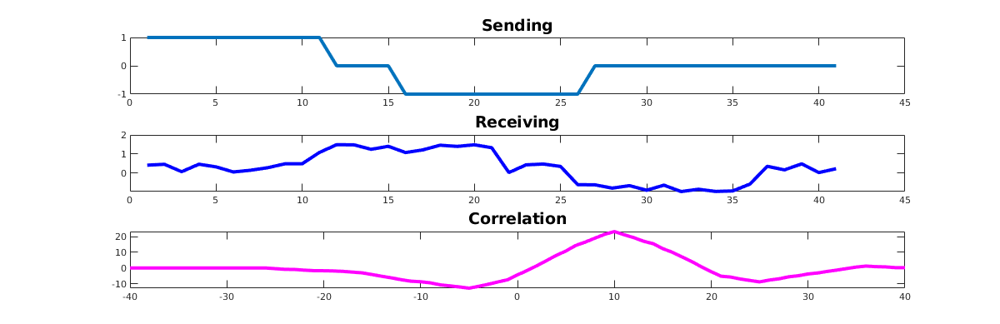

# Experiment 4
# Delay Detection in Noisy Signal and Periodicity of A Signal
***
```
Author: Abdiullah Al Rafi
ID: 1810018
Date: May 16, 2023
```
## 4.1 Theory
Correlation is useful in identifying signal delays. For example, let’s say that a signal is sent from a transmitter and arrives at the receiver after being delayed by an unknown interval of time. This objective can be achieved by cross-correlating the signal sent with the signal received.  Worse case where the signal is greatly affected by noise, to the point where it's difficult to make out the shape of the signal with bare eyes. Nevertheless, the corresponding correlated signal exhibits a peak at almost the same point. The result obtained will exhibit a peak at the time when the received signal matches with the test signal the best when the test signal is shifted by some units along the time-axis.

$$R_{xy}[m]=\Sigma_{n=-\infty} ^ {\infty} x[n]y^\star [n-m]$$

Autocorrelation is a statistical measure that indicates the similarity between a variable and a delayed version of itself. The autocorrelation function can be used to determine the periodicity of a signal by looking for peaks in the autocorrelation function. The peaks in the autocorrelation function correspond to the periods of the signal.

$$R_{xx}[m]=\Sigma_{n=-\infty} ^ {\infty} x[n]x^\star [n-m]$$

## 4.2 Matlab Code
### 4.2.1 Determine Delay
```matlab
t = 0:1:40;
s1 = t>=0 & t<=10;
s2 = (t>=15 & t<=25)*(-1);
x = s1+s2;
subplot(3,1,1);
plot(x);
title("Sending")
s3 = t>=10 & t<=20;
s4 = (t>=25 & t<=35)*(-1);
y = s3+s4;
y = y+0.5*rand(size(y));
subplot(3,1,2);
plot(y);
title("Receiving");
r = xcorr(y,x);

maxim = -1;
indx = -1;
for i=1:length(r)
    if r(1,i) > maxim
        maxim = r(1,i);
        indx = i;
    end
end
disp(indx-40-1);
subplot(3,1,3);
plot(-40:1:40,r);
title("Correlation");
```
### 4.2.2 Determine Periodicity
```matlab
t = 0:1:10;
s1 = t>=2 & t<=8;
s2 = (t>=4 & t<=6)*(2);

x = s1+s2;
x = [x x x x];
subplot(2,1,1);
plot(x);
title("Signal")
r = xcorr(x);
subplot(2,1,2);
plot(r);
title("Auto-correlation");
```
## 4.3 Output
### 4.3.1 Delay Detection in Noisy Signal

