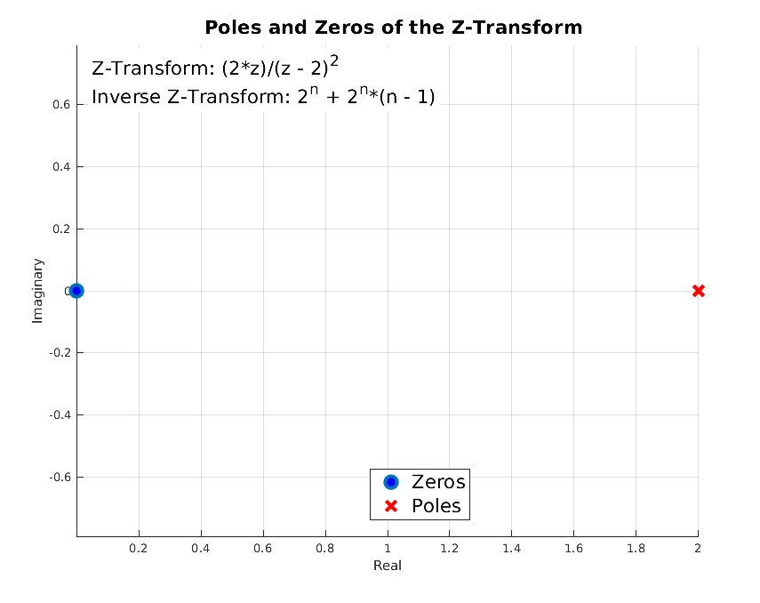

# Experiment 5
# Inverse Z-transform Using MATLAB
***
```
Author: Abdiullah Al Rafi
ID: 1810018
Date: June 06, 2023
```
Table of Contents
- [Experiment 5](#experiment-5)
- [Inverse Z-transform Using MATLAB](#inverse-z-transform-using-matlab)
  - [5.1 Theory](#51-theory)
  - [5.2 Matlab Code](#52-matlab-code)
  - [5.3 Output](#53-output)
  - [5.4 Conclusion](#54-conclusion)

## 5.1 Theory
The inverse Z-transform is defined as the process of finding the time domain signal $x(n)$ from its Z-transform $X(z)$. The inverse Z-transform is denoted as −
$$x(n)=Z^{−1} X(Z)$$
where $x,n$ is the signal in time domain and $X,Z$ is the signal in frequency domain.

## 5.2 Matlab Code
```matlab
syms n z;  
f = 2^n + 2^n*(n - 1);  

F = ztrans(f, n, z);
f_inv = iztrans(F, z, n);

[num, den] = numden(F);  
zeros_F = double(solve(num, z));  
poles_F = double(solve(den, z));

figure;  
hold on;  
plot(real(zeros_F), imag(zeros_F), 'o', 'MarkerSize', 10, 'MarkerFaceColor', 'b');  
plot(real(poles_F), imag(poles_F), 'x', 'MarkerSize', 10, 'LineWidth', 2, 'Color', 'r');  
xlabel('Real');  
ylabel('Imaginary');  
title('Poles and Zeros of the Z-Transform');  
legend('Zeros', 'Poles');  
grid on;  
axis equal;

% Add z-transform and inverse z-transform expressions as text annotations  
z_transform_str = ['Z-Transform: ', char(F)];  
inv_z_transform_str = ['Inverse Z-Transform: ', char(f_inv)];  
text(min(xlim), max(ylim), {z_transform_str, inv_z_transform_str}, ...  
    'HorizontalAlignment', 'left', 'VerticalAlignment', 'top', 'FontSize', 10, 'BackgroundColor', 'w');

hold off;
```

## 5.3 Output


## 5.4 Conclusion
In this experiment, we successfully used inverse Z transform of a signal and plotted poles and zeros.