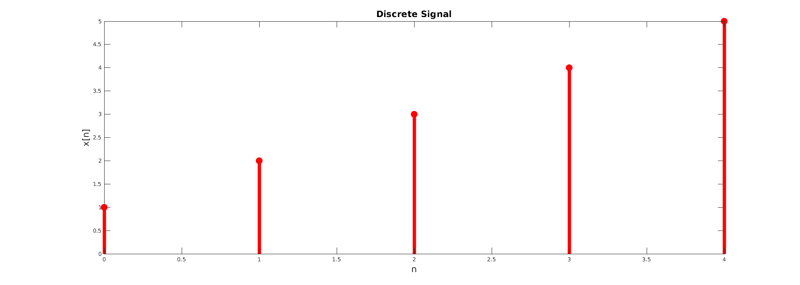
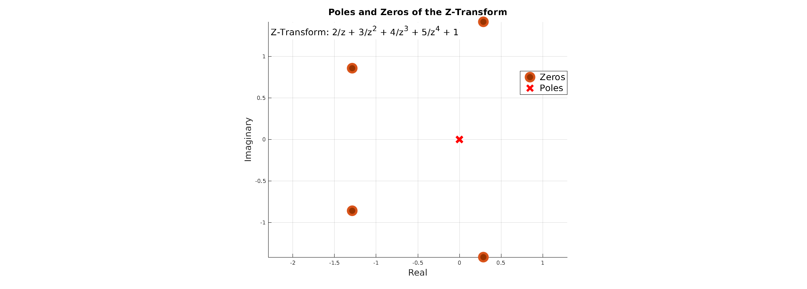
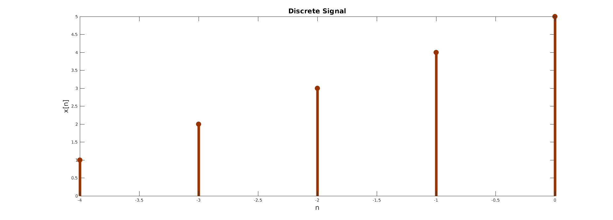
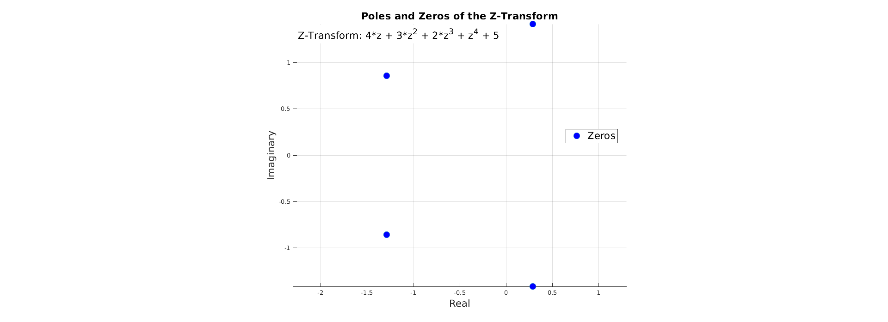
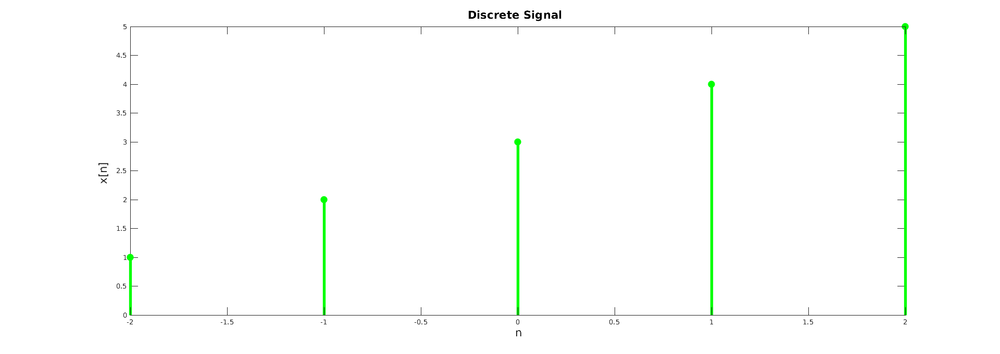
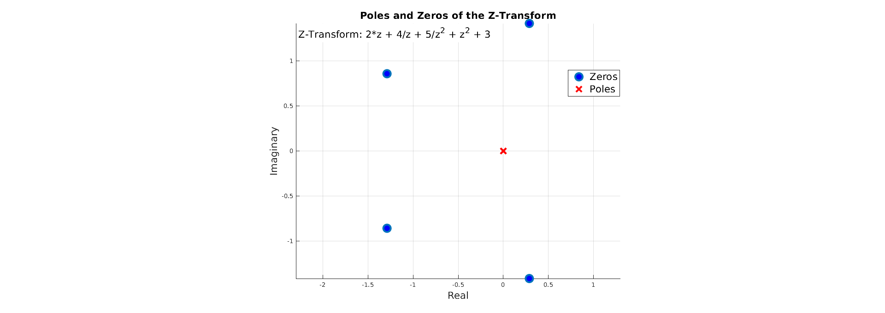

# Experiment 5

# Z-transform and Plot Poles and Zeros using MATLAB

---

```
Author: Abdiullah Al Rafi
ID: 1810018
Date: June 06, 2023
```

Table of Contents

- [Experiment 5](#experiment-5)
- [Z-transform and Plot Poles and Zeros using MATLAB](#z-transform-and-plot-poles-and-zeros-using-matlab)
  - [5.1 Theory](#51-theory)
  - [5.2 Matlab Code](#52-matlab-code)
    - [5.2.1 Causal Code](#521-causal-code)
    - [5.2.2 Anti-Causal Code](#522-anti-causal-code)
    - [5.2.3 Non-causal Code](#523-non-causal-code)
  - [5.3 Output](#53-output)
  - [5.3.1 Causal](#531-causal)
  - [5.3.2 Anti-Causal](#532-anti-causal)
  - [5.3.3 Non Causal](#533-non-causal)
  - [5.4 Conclusion](#54-conclusion)

## 5.1 Theory

Z transform is to discrete-time systems what the Laplace transform is to continuous-time systems where $z$ is a complex variable.
$$\mathcal{Z}\left\lbrace f[n]\right\} = F(z) = \sum_{n=0}^{\infty} f[n]z^{-n}$$

**_Causal Signal_**

A continuous time signal 𝑥(𝑡) is called causal signal if the signal $x(t)=0$ for $t<0$. Therefore, a causal signal does not exist for negative time.

**_Anti-Causal Signal_**

A continuous-time signal x(t) is called the anti-causal signal if $x(t) = 0$ for $t > 0$. Hence, an anti-causal signal does not exist for positive time.

**_Non-Causal Signal_**

A signal which is not causal is called the non-causal signal. Hence, by the definition, a signal that exists for positive as well as negative time is neither causal nor anti-causal, it is non-causal signal.

## 5.2 Matlab Code

### 5.2.1 Causal Code

```matlab
syms z;

% Discrete signal
x = [1, 2, 3, 4, 5];

% Shift the signal to have zero position at 2
n = 0:length(x)-1;
n_shifted = n;

% Define the shifted signal as a symbolic expression
x_shifted = sym(x) .* z.^(-n_shifted);

% Find the z-transform by summing the shifted signal
X = sum(x_shifted);

disp('Z-transform of the shifted signal:');
disp(X);

% Find zeros and poles
[num, den] = numden(X);
zeros = double(solve(num, z));
poles = double(solve(den, z));

disp('Zeros of the z-transform:');
disp(zeros);
disp('Poles of the z-transform:');
disp(poles);
% Plot the discrete signal
figure;
stem(n_shifted, x, 'filled');
xlabel('n');
ylabel('x[n]');
title('Discrete Signal');

% Plot zeros and poles
figure;
hold on;
plot(real(zeros), imag(zeros), 'o', 'MarkerSize', 10, 'MarkerFaceColor', 'b');
plot(real(poles), imag(poles), 'x', 'MarkerSize', 10, 'LineWidth', 2, 'Color', 'r');
xlabel('Real');
ylabel('Imaginary');
title('Poles and Zeros of the Z-Transform');
legend('Zeros', 'Poles');
grid on;
axis equal;
z_transform_str = ['Z-Transform: ', char(X)];
text(min(xlim), max(ylim), {z_transform_str}, ...
    'HorizontalAlignment', 'left', 'VerticalAlignment', 'top', 'FontSize', 10, 'BackgroundColor', 'w');

hold off;
```

### 5.2.2 Anti-Causal Code

```matlab
syms z;

% Discrete signal
x = [1, 2, 3, 4, 5];

% Shift the signal to have zero position at 2
n = 0:length(x)-1;
n_zero = 4;
n_shifted = n - n_zero;

% Define the shifted signal as a symbolic expression
x_shifted = sym(x) .* z.^(-n_shifted);

% Find the z-transform by summing the shifted signal
X = sum(x_shifted);

disp('Z-transform of the shifted signal:');
disp(X);

% Find zeros and poles
[num, den] = numden(X);
zeros = double(solve(num, z));
poles = double(solve(den, z));

disp('Zeros of the z-transform:');
disp(zeros);
disp('Poles of the z-transform:');
disp(poles);
% Plot the discrete signal
figure;
stem(n_shifted, x, 'filled');
xlabel('n');
ylabel('x[n]');
title('Discrete Signal');

% Plot zeros and poles
figure;
hold on;
plot(real(zeros), imag(zeros), 'o', 'MarkerSize', 10, 'MarkerFaceColor', 'b');
plot(real(poles), imag(poles), 'x', 'MarkerSize', 10, 'LineWidth', 2, 'Color', 'r');
xlabel('Real');
ylabel('Imaginary');
title('Poles and Zeros of the Z-Transform');
legend('Zeros', 'Poles');
grid on;
axis equal;
z_transform_str = ['Z-Transform: ', char(X)];
text(min(xlim), max(ylim), {z_transform_str}, ...
    'HorizontalAlignment', 'left', 'VerticalAlignment', 'top', 'FontSize', 10, 'BackgroundColor', 'w');

hold off;
```

### 5.2.3 Non-causal Code

```matlab
clc
clearvars
syms z;

% Discrete signal
x = [1, 2, 3, 4, 5];

% Shift the signal to have zero position at 2
n = 0:length(x)-1;
n_zero = 2;
n_shifted = n - n_zero;

% Define the shifted signal as a symbolic expression
x_shifted = sym(x) .* z.^(-n_shifted);

% Find the z-transform by summing the shifted signal
X = sum(x_shifted);

disp('Z-transform of the shifted signal:');
disp(X);

% Find zeros and poles
[num, den] = numden(X);
zeros = double(solve(num, z));
poles = double(solve(den, z));

disp('Zeros of the z-transform:');
disp(zeros);
disp('Poles of the z-transform:');
disp(poles);
% Plot the discrete signal
figure;
stem(n_shifted, x, 'filled');
xlabel('n');
ylabel('x[n]');
title('Discrete Signal');

% Plot zeros and poles
figure;
hold on;
plot(real(zeros), imag(zeros), 'o', 'MarkerSize', 10, 'MarkerFaceColor', 'b');
plot(real(poles), imag(poles), 'x', 'MarkerSize', 10, 'LineWidth', 2, 'Color', 'r');
xlabel('Real');
ylabel('Imaginary');
title('Poles and Zeros of the Z-Transform');
legend('Zeros', 'Poles');
grid on;
axis equal;
z_transform_str = ['Z-Transform: ', char(X)];
text(min(xlim), max(ylim), {z_transform_str}, ...
    'HorizontalAlignment', 'left', 'VerticalAlignment', 'top', 'FontSize', 10, 'BackgroundColor', 'w');

hold off;
```

## 5.3 Output

## 5.3.1 Causal



Zeros of the z-transform:
$$ (0.2878 - 1.4161i), (0.2878 + 1.4161i),(-1.2878 - 0.8579i),(-1.2878 + 0.8579i)$$

Poles of the z-transform:
$$ 0,0,0,0$$

## 5.3.2 Anti-Causal



Zeros of the z-transform:
$$ (0.2878 - 1.4161i),(0.2878 + 1.4161i),(-1.2878 - 0.8579i),(-1.2878 + 0.8579i)$$

Poles of the z-transform:
$$ \infty $$

## 5.3.3 Non Causal



Zeros of the z-transform:
$$ (0.2878 - 1.4161i), (0.2878 + 1.4161i),(-1.2878 - 0.8579i),(-1.2878 + 0.8579i) $$

Poles of the z-transform:
$$ 0,0$$

## 5.4 Conclusion

In this experiment, we successfully used Z transform of a signal and plotted poles and zeros.
