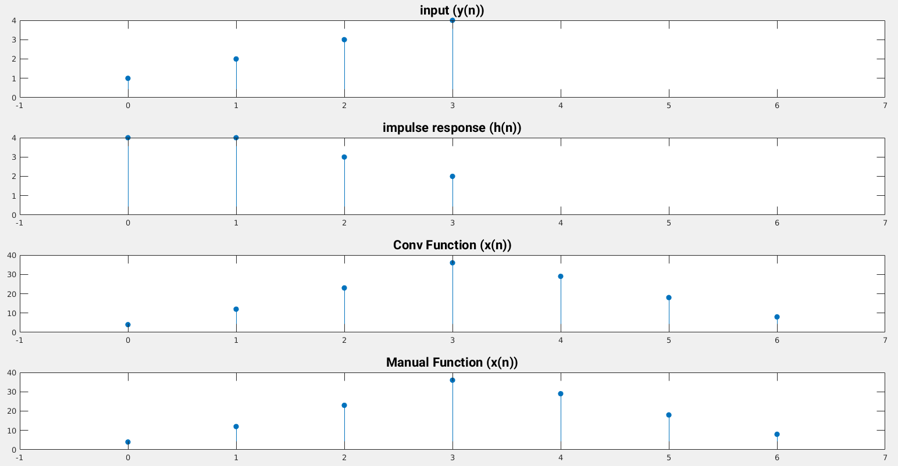

# Experiment 1

# Compare Built-in and User Defined Convolution Function

---

```
Author: Abdiullah Al Rafi
ID: 1810018
Date: May 16, 2023
```

## 1.1 Theory

In a linear time-invariant (LTI) system, convolution sum is a mathematical operation used to express the relation between input and output of the system. It is expressed as

$$y(n)= x(n) \star h(n)=\Sigma_{k=-\infty} ^ {\infty} x(k)h(n-k)$$

the input $x(n)$ is convolved with the impulse response $h(n)$ to yield the output $y(n)$.

## 1.2 Matlab Code

```matlab
n1 = 0 : 1 : 3;
y1 = [ 1 2 3 4 ];
h1 = [ 4 4 3 2 ];
n2 = 0 : 1 : 6;
X = conv (h1, y1);
h_new = flip(h1);
answ = 1:1:4+3;
answ = answ * 0.0;
for i = 1:1:4
    for j=1:1:i
        answ(i) = answ(i) + y1(j)*h_new(j+4-i);
    end
end

for i = 2:1:4
    for j=i:1:4
        answ(i+4-1) = answ(i+4-1) + y1(j)*h_new(j-i+1);
    end
end
subplot(4,1,1)
stem(n1, y1,'filled')
xlim([-1 7])
title('input (y(n))')
subplot(4,1,2)
stem(n1, h1,'filled')
xlim([-1 7])
title('impulse response (h(n))');
subplot(4,1,3)
stem(n2, X,'filled')
xlim([-1 7])
title('Conv Function (x(n))');
subplot(4,1,4)
stem(n2, answ,'filled')
xlim([-1 7])
title('Manual Function (x(n))');
```

## 1.3 Output


Figure 1.1: Built-In vs User defined Convolution

## 1.4 Conclusion

In this experiment, we successfully detected delay in noisy signal and found periodicity of a signal.
