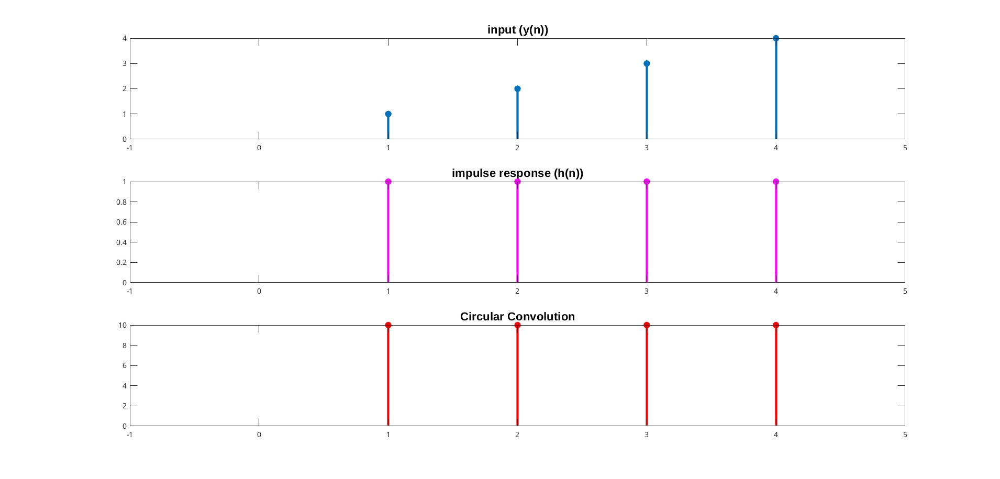
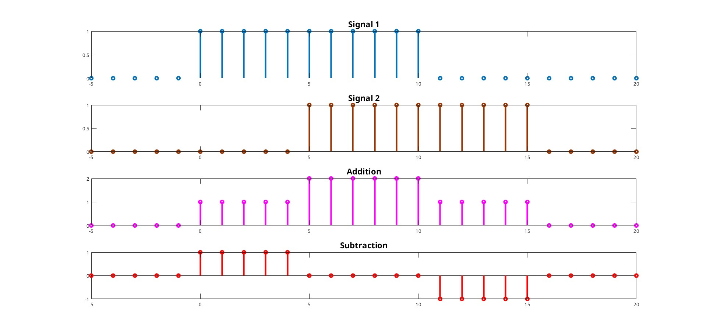
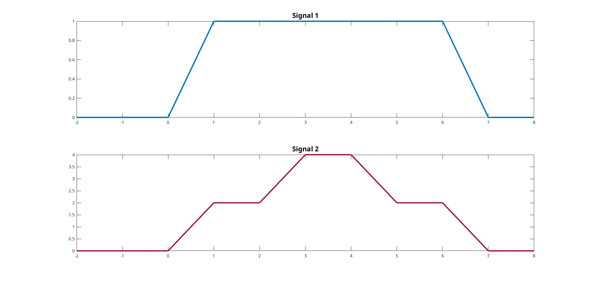

# Experiment 2

# Circular Convolution, Signal Arithmetic & Signal Drawing

---

```
Author: Abdiullah Al Rafi
ID: 1810018
Date: May 16, 2023
```

## 2.1 Theory

Circular convolution, also known as cyclic convolution, is a special case of periodic convolution, which is the convolution of two periodic functions that have the same period. For any vectors $x = (x_1, x_2, ... , x_T)^{\top} \in \mathbb{R}^{\top}$ and $y = (y_1, y_2, ... , y_{\tau})^{\top} \in \mathbb{R}_{\tau}$ with $\tau \leq T$ , the circular convolution of
two vectors is
$$z= x \star y \in \mathbb{R}^{\top}$$

## 2.2 Matlab Code

### 2.2.1 Circular Convolution

```matlab
x = [1 2 3 4];
h = [1; 1; 1; 1];

tab = zeros(4,4);

for i = 1:1:4
    for j = 1:1:4
        tab(j,i) = x(j);
    end
    x = circshift(x, 1);
end

answ = tab * h;
```

### 2.2.2 Arithmetic Operation on Signals

```matlab
t = -5:1:20;

fun1 = t>=0 & t<=10;
fun2 = t>=5 & t<=15;

addition = fun1 + fun2;
subtraction = fun1 - fun2
```

### 2.2.3 Signal Drawing

```matlab
t = -2:0.001:8;

unit = t>=1 & t<6;
unit2 = t>=3 & t<4;
ramp = (t>=0 & t<1) .* t;
ramp2 = (t>=6 & t<7) .* (7-t);
ramp3 = (t>=2 & t<3) .* (t-2);
ramp4 = (t>=4 & t<5) .* (5-t);

answ1 = unit + ramp+ramp2;
answ2 = 2*unit + 2*ramp+2*ramp2+unit2*2+2*ramp3+2*ramp4
```

## 2.3 Output


Figure 2.1: Circular Convolution


Figure 2.2: Arithmetic Operation on Signals


Figure 2.3: Signal Drawing

## 2.4 Conclusion

The input, impulse and circular convolution signal is shown in figure 2.1. Figure 2.2 has two discrete signal and addition, subtraction operation between them. To draw the output figure 2.3, we used unit step, unit ramp and with conditions.
