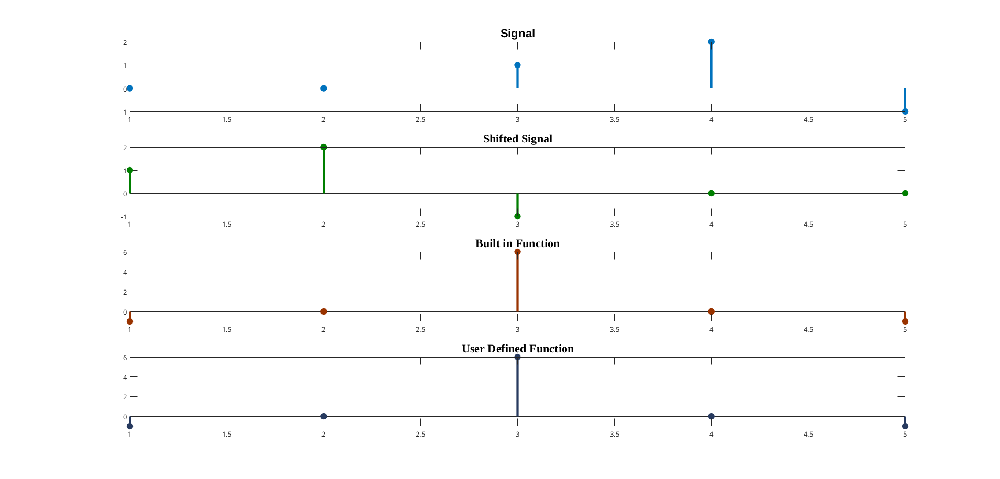
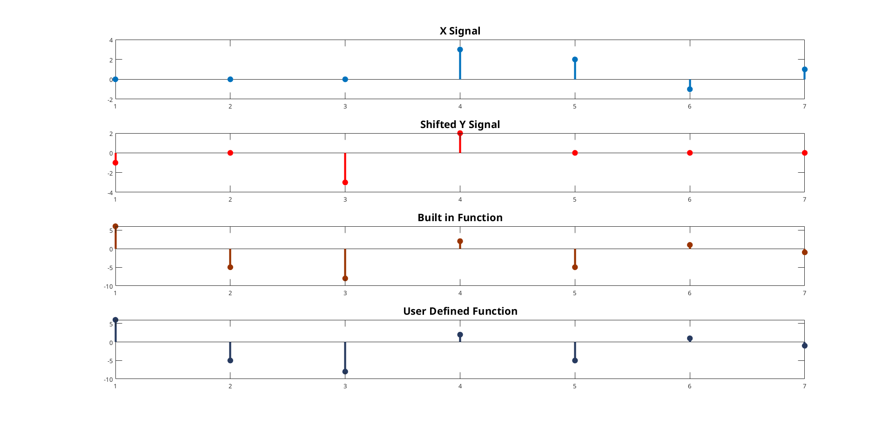

# Experiment 3

# Autocorrelation and Cross-Correlation

---

```
Author: Abdiullah Al Rafi
ID: 1810018
Date: May 16, 2023
```

## 3.1 Theory

The concept of correlation in general quantifies the similarity of two spatial- or time-dependent signals $x$ and $y$. Depending on whether the signals considered for correlation are same or different, we have two kinds of correlation: autocorrelation and cross-correlation.

### 3.1.1 Autocorrelation

Autocorrelation is used to compare a signal with a time-delayed version of itself. If a signal is periodic, then the signal will be perfectly correlated with a version of itself if the time-delay is an integer number of periods. Autocorrelation of the discrete time signal $x[n]$ is expressed as

$$R_{xx}[m]=\Sigma_{n=-\infty} ^ {\infty} x[n]x^\star [n-m]$$

### 3.1.2 Cross-correlation

Cross-correlation is a measure of similarity of two series as a function of the displacement of one relative to the other. This is also known as a sliding dot product or sliding inner-product. Cross-correlation of the discrete time signals $x[n]$ and $y[n]$ is expressed as

$$R_{xy}[m]=\Sigma_{n=-\infty} ^ {\infty} x[n]y^\star [n-m]$$

## 3.2 Matlab Code

### 3.2.1 Autocorrelation

```matlab
% x = [-1 2 1];
x = input("Enter X Value: ");
n = length(x);
r = xcorr(x);
x_ze = zeros(n+(n-1)*2,1);
for i=1:n
    x_ze(i+n-1) = x(i);
end
x_zeT = zeros(1,n+(n-1)*2);
for i=1:n
    x_zeT(i) = x(i);
end

answ = zeros(n+n-1,1);
for i=1:(n+n-1)
    answ(i,1) = x_zeT * x_ze;
    x_zeT = circshift(x_zeT,1);
end
disp(answ)
```

### 3.2.2 Cross-correlation

```matlab
% x = [-3 2 -1 1];
x = input("Enter X Value: ");
n = length(x);

% y = [-1 0 -3 2];
y = input("Enter Y Value: ");
n2 = length(y);

r = xcorr(x,y);

x_ze = zeros(n+(n2-1)*2,1);
for i=1:n
    x_ze(i+(n2-1)) = x(i);
end
x_zeT = zeros(1,n+(n2-1)*2);
for i=1:n2
    x_zeT(i) = y(i);
end

answ = zeros(n+n2-1,1);
for i=1:(n+n2-1)
    answ(i,1) = x_zeT * x_ze;
    x_zeT = circshift(x_zeT,1);
end
disp(r)
disp(answ)
```

## 3.3 Output


Figure 3.1: Autocorrelation


Figure 3.2: Cross-correlation

## 3.4 Conclusion

In this experiment, we successfully implemented Autocorrelation and Cross-correlation. Our implemented function gave similar output as built-in function which is clearly visualized in Fig.3.1 and Fig.3.2.
